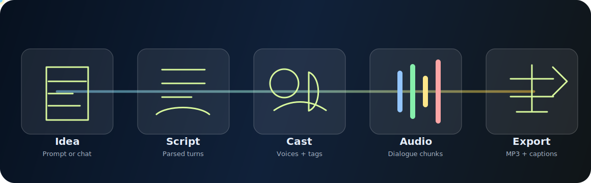
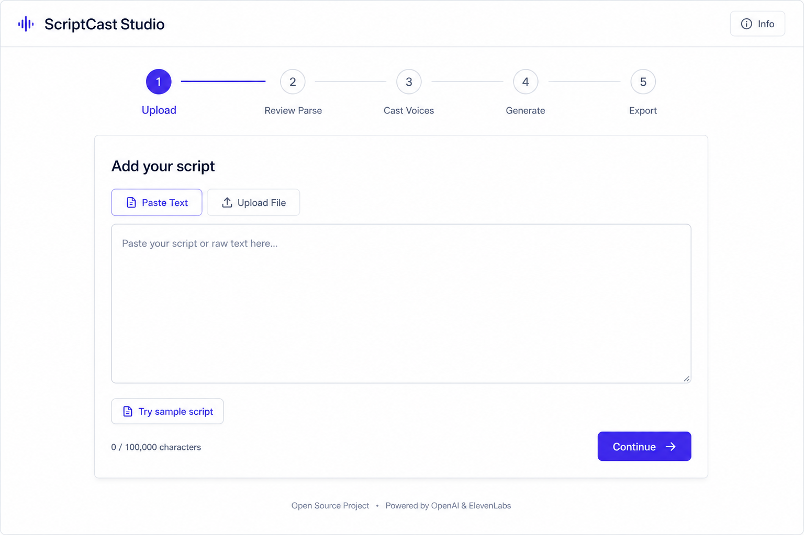

<p align="center">
  
</p>

<h1 align="center">ScriptCast Studio</h1>

<p align="center">
  Turn rough ideas, pasted scripts, or story-development chats into multi-character ElevenLabs audio projects.
</p>

<p align="center">
  
  
  
  
  
</p>

---

## What It Does

ScriptCast Studio is a local-first production tool for building audio scenes:

- Develop a story idea through short AI chat, then generate a parser-friendly script.
- Parse screenplay, transcript, prose, or chat-like text into characters and turns.
- Suggest and design ElevenLabs voices for each character.
- Add optional ElevenLabs v3 delivery tags and concrete sound-effect cues.
- Render dialogue chunks, background sound effects, captions, and a final merged MP3.
- Export project artifacts as audio, JSON, VTT, and a zipped manifest.

It runs in mock mode without API keys, so the UI and workflow can be tested safely before making real OpenAI or ElevenLabs calls.

## Product Preview

<p align="center">
  
</p>

## Why It Exists

Most AI script generators can produce a block of text, but they do not naturally produce something that is ready for multi-voice audio generation. ScriptCast Studio is built around the production details that matter after the first draft:

- stable speaker labels
- speakable dialogue
- audible stage directions
- voice assignment
- chunking
- caption timing
- retryable generation jobs
- exportable artifacts

The goal is not just "generate a script." The goal is "generate something you can cast, render, review, and ship."

## Workflow

1. **Idea or raw script**
   Start from a pasted script, a sample scene, or an AI-assisted idea chat.

2. **Script generation**
   OpenAI drafts parser-friendly screenplay text with a tuned general-purpose system prompt.

3. **Parse and enhance**
   The app extracts characters, turns, narration, stage directions, and optional delivery tags.

4. **Cast voices**
   ElevenLabs voice search/design helps map characters to voices.

5. **Render audio**
   Dialogue and sound-effect segments are generated, mixed into chunks, and merged into a final MP3.

6. **Export**
   Download final audio, captions, manifests, and project artifacts.

## Prompt Lab

This repo includes a side CLI lab for testing script-generation system prompts without touching the main UI.

```bash
npm run prompt:lab -- --idea "A lighthouse keeper hears a rescue call from the future."
```

Useful options:

```bash
npm run prompt:lab -- --idea "..." --limit 3 --mock
npm run prompt:lab -- --case data/prompt-lab-case.json
```

Prompt lab runs are written to `prompt-lab-runs/<timestamp>/report.md` and `results.json`. The folder is ignored by git so experimental generations do not get committed accidentally.

## Tech Stack

- **Next.js App Router** for UI and API routes
- **React 19** for the production workspace
- **TypeScript** across app, API, and generation code
- **OpenAI Responses API** for chat, draft generation, parsing, and enhancement
- **ElevenLabs Text to Dialogue v3** for character dialogue
- **ElevenLabs sound generation** for standalone sound-effect turns
- **ffmpeg / ffprobe** for audio probing, mixing, and final export
- **Vitest** for route, parser, generator, storage, and resilience tests

## Setup

```bash
npm install
cp .env.example .env.local
npm run dev
```

Open:

```text
http://localhost:3000
```

Mock mode is enabled when API keys are missing or `SCRIPTCAST_MOCK_MODE=true`.

## Environment

Copy `.env.example` to `.env.local`, then fill in only what you need.

```bash
SCRIPTCAST_MOCK_MODE=true
SCRIPTCAST_ACCESS_CODE=

OPENAI_API_KEY=
OPENAI_MODEL=gpt-5.4-mini

ELEVENLABS_API_KEY=
ELEVENLABS_DIALOGUE_MODEL=eleven_v3
ELEVENLABS_SOUND_EFFECT_MODEL=eleven_text_to_sound_v2
ELEVENLABS_TIMEOUT_MS=90000
ELEVENLABS_MAX_CONCURRENCY=3

FFMPEG_PATH=ffmpeg
FFPROBE_PATH=ffprobe
MEDIA_TOOL_TIMEOUT_MS=120000
SFX_BACKGROUND_VOLUME=0.35
SCRIPTCAST_STORAGE_DIR=
```

On macOS, set `SCRIPTCAST_STORAGE_DIR` to a non-iCloud folder if the repo lives under `Documents`, Desktop, or another optimized-storage location. When it is unset, ScriptCast uses `~/Library/Application Support/ScriptCast Studio` for cloud-managed macOS working directories and `.scriptcast/` elsewhere.

## Commands

```bash
npm run dev
npm run build
npm run lint
npm test
```

Additional local access helpers:

```bash
npm run dev:iphone
npm run tunnel
```

## iPhone / Cloudflare Access

The app can be exposed through a Cloudflare quick tunnel while generated files stay on the Mac running the app.

```bash
npm run dev:iphone
npm run tunnel
```

Open the `https://...trycloudflare.com` URL on your phone and enter the `SCRIPTCAST_ACCESS_CODE` from `.env.local`.

The Mac must stay awake, online, and running both commands. For a permanent always-on deployment, use a server with persistent disk storage and set `SCRIPTCAST_STORAGE_DIR` to that disk because generated audio and manifests are stored locally.

## API Routes

| Route | Purpose |
| --- | --- |
| `POST /api/idea-chat` | Develop a story idea through short multiple-choice chat |
| `POST /api/script` | Generate a script from an idea or conversation |
| `POST /api/parse` | Parse script text into project structure |
| `POST /api/enhance` | Add delivery tags and sound-effect improvements |
| `GET /api/voices/search` | Search ElevenLabs voices |
| `POST /api/voices/design` | Design a voice prompt |
| `POST /api/generate` | Start audio generation |
| `GET /api/generate/:jobId` | Poll generation status |
| `GET /api/export/:projectId` | Download merged audio or project artifacts |

## Project Structure

```text
app/                         Next.js pages and API routes
components/                  Main studio UI
lib/                         Parsing, storage, OpenAI, ElevenLabs, audio, workflow
tests/                       Vitest coverage for app and generation behavior
tools/script-prompt-lab.ts   CLI prompt comparison harness
data/sample-scripts/         Sample input scripts
docs/assets/                 README and documentation assets
```

## Testing

The suite covers the parts most likely to break production output:

- script drafting and prompt-lab behavior
- parser resilience
- chunking and generation flow
- ElevenLabs retry/error handling
- audio export and ZIP artifacts
- API status and auth rate limiting

Run everything:

```bash
npm test
```

## Sample Input

A sample script is available at:

```text
data/sample-scripts/rooftop-signal.md
```

It is also available through the app's **Try sample script** button.

## Notes

- `.env`, `.env.local`, `.scriptcast/`, `.next/`, prompt-lab outputs, logs, and local browser automation artifacts are ignored.
- Real API calls happen only on server routes and only when mock mode is disabled with the relevant API keys present.
- Generated audio is stored locally; do not treat a Cloudflare quick tunnel as a durable deployment.
